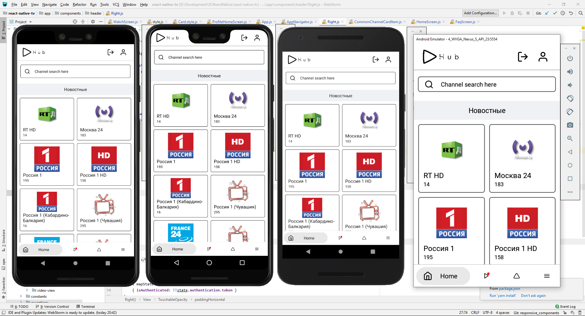
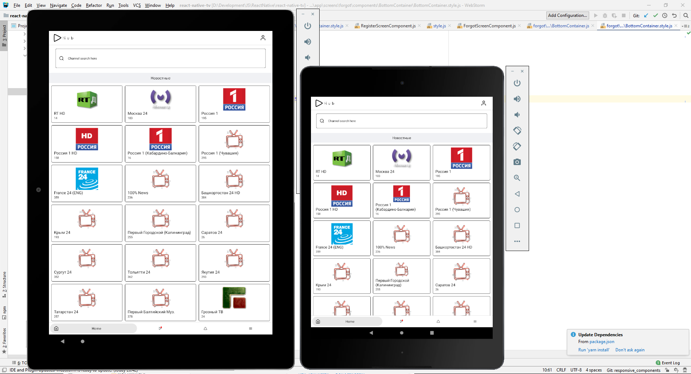

  
  <h1>PlayHub</h1>
  <h4>Share your playlist here and now!</h4>
  <h5>An application in which users can create and share with their personal or public playlists with other users of the application with the possibility of monetization.</h5>

### Try It

#### Android different app split by CPU architecture

- [x] [armeabi-v7a](https://drive.google.com/file/d/1iUdLoLwNO_BHcZqM6oUKRZZYzwFKrFkq/view?usp=sharing): 
- [x] [arm64-v81](https://drive.google.com/file/d/17NEERR9oqZl5rH3LtETwYSxcSSexzXBn/view?usp=sharing)
- [x] [x86_64](https://drive.google.com/file/d/1mKTe7ARn2u0bgg5W1a1v5KodjHuVQgo5/view?usp=sharing)
- [x] [x86](https://drive.google.com/file/d/1EtxKAzntGIlp9PdzNzHFmTabNxJghvNj/view?usp=sharing)

#### iOS

nothing...

### View on YouTube

### Responsive Layout

Mobile | Tabled/Pad
--- | --- |
 | 

### Disclaimer

At the moment, the code in some places may force you:

- scared
- I do not like
- refusal
- trembling skin

I apologize, everything will be fixed in the future. ^_^

> Premature optimization is the root of all evil (or at least most of it) in programming.
> -- <cite>[Donald Ervin Knuth][1]</cite> «Computer Programming as an Art», «Communications of the ACM» (Vol. 17, Issue 12)

[1]:http://www.paulgraham.com/knuth.html

Functionality, UI, screenshots and content in different languages: English and Russian. Soon there will be i18n.

## Функционал

#### Основное

- [x] Просмотр официальных каналов на главном скрине приложения.
- [x] Просмотр контента, добавленных пользователями на скринах: PlayHub, ТОП100, Самые просматриваемые, Лучшие оценки, Новое.
- [x] Просмотр из локальной базы данных, в которую добавляет контент сам пользователь.
- [x] Просмотр из раздела IPTV, где сканируется iptv плейлист формата m3u8.

#### Пользователи могут публиковать свой контент:

- [x] Существует возможность вставки своей рекламы: очень нужный функционал, надо реализовывать.
- [x] Официальные пользователи могут показывать свой контент на главном скрине приложения.
- [x] Выбирать различные опции: выбор плеера, выбор потока, свой плеер, архив, закрепить у себя на стене.
- [x] Видимость: публичное, приватное, только друзьям.

#### Пользователи могут смотреть контент и совершать действия с контентом:

- [x] Выбирать между несколькими плеерами для просмотра.
- [x] Сохранять в локальную базу данных на устройстве.
- [ ] Лайкнуть/Убрать лайк: по сути мелочь, на сервере есть заготовки нужно довести до ума, а так же реализовать Redux store с последующим выводом на странице лайков, а атк же добавления туда остальных лайков.
- [ ] Пожаловаться: не качественный контент, не работает, не соответствует описанию, контент для взрослых не помечены, оскорбительный контент: нужно подумать над внешним видом, возможно это модалка или оставить bottom sheet behavior который уже есть + реализация серверной стороны.
- [x] Поставить оценку и оставить отзыв (опционально).
- [ ] Оценивать отзывы остальных пользователей: нужно провести работы на стороне сервера.
- [x] Совершать действия с фильтрации и поиска: по типу, по категории, 18+.
- [x] Телепрограмма для контента на главной странице.

#### Личный функционал пользователя:

- [x] Смена паролей.
- [x] Смена имени.
- [ ] Уведомления (в будущем).
- [x] Активация премиума.
- [ ] Настройки приватности (в будущем).

#### Функционал общения:

- [ ] Личные сообщения с пользователями: обычный текст, делиться контентом в видео контента. Нужно подумать над дизайном. __(не приоритетно)__
- [ ] Написать разработчику + техническая отладочная информацияЖ по сути легий функционал осталось всего-то реализовать на стороне сервера.
- [x] Друзья, и подписчики: принять, отказать, удалить.
- [ ] Dashboard Пользователей: остался только поиск.

#### Дополнительный функционал:

- [x] Родительский контроль на 18+ контент.
- [x] Парсинг IPTV плейлистов с дальнейшим просмотром: осталось добавить мелочи, типа сохранения в локальную базу данных и небольшие изменения макета экрана.
- [x] Проверка работоспособности контента, ссылки: есть и работает, нужно переделать внешний вид, особенно кнопок...
- [x] Авторизированные пользователи могут менять цветовые схемы приложения.

#### Функционал авторизации и аунтификации:

- [x] Логин: email, пароль
- [x] Регистрация: email, username, пароль, device id
- [x] Восстановление пароля: email
- [ ] OAuth авторизация (пока даже не трогаем, но было бы прикольно)

#### Контент:

- [x] Все вместе.
- [x] Лучшее.
- [ ] ТОП 100 (подсчёт отношения оценки к количеству оценок).
- [ ] Самое просматриваемое.
- [ ] Новый контент.
- [x] На страницах пользователей.

#### Пользователи:

- [x] Обычные
- [x] Авторизованные: обычные, премиум

### Поиск

- [x] Поиск по главной
- [x] Поиск в PlayHub + фильтры
- [ ] Глобальный поиск: нужно подумать над дизайном и размещением, возможно кнопочкой лупы в хедере с последующей "всплывашкой" или на экране с меню.

### Монетизация

- [x] AdMob (Firebase)
- [x] Прероллы в видеоплеерах

### Интернационализация

- [x] Русский
- [ ] Английский частично :)

### Платформы

- [x] Android
- [ ] iOS
- [ ] Android TV
- [ ] tvOS

### Related Projects

1. [VK TV Mini App (desktop)](https://github.com/zikwall/vk-tv-desctop)
2. [VK TV Mini App (mobile)](https://github.com/zikwall/vk-tv)
3. [SEO Friendly App by Next,js](https://github.com/zikwall/tv-next)
4. [Backend based on PHP7 via Yii2 (custom module)](https://github.com/zikwall/vk-tv-backend)
5. [Playlist parser (PHP)](https://github.com/zikwall/m3uparse)
6. [Playlist parser (Go)](https://github.com/zikwall/go3uparse)
