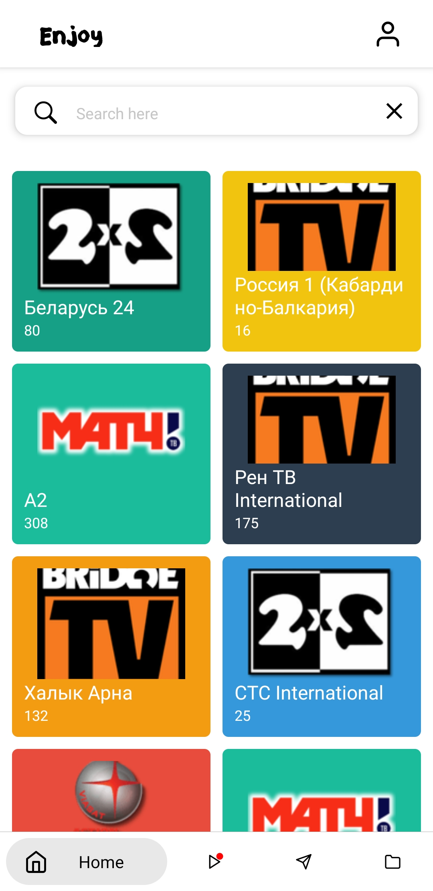
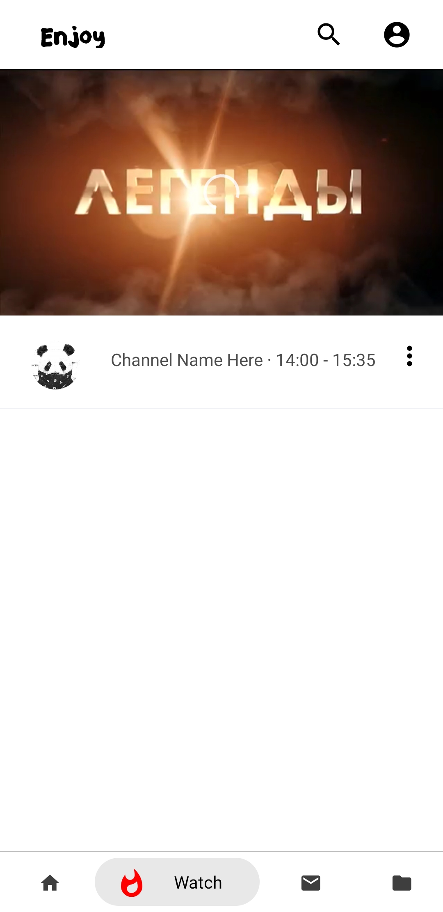

  <h1>PlayHub</h1>
  <h5>An application in which users can create and share with their personal or public playlists with other users of the application with the possibility of monetization.</h5>

## Base Features & Roadmap
 
- [x] WebView
    - [x] JW Player
    - [ ] Plyr
    - [ ] Video.js
- [X] Ads
    - [x] Preroll on Video Player (IMA, VAST, etc.)
    - [ ] ADMob
    - [ ] Interstitial 
    - [ ] Other native ad
- [x] Screens
    - [x] Home
    - [x] Watch
    - [ ] Favorites
    - [ ] User profile
    - [ ] Apps Library
    - [ ] About
    - [ ] Terms
- [x] Components
    - [x] Search
    - [x] App preloader
    - [ ] Drawer Navigation
    - [ ] TV program list
    - [ ] Current TV program
- [ ] Native Players
    - [ ] ExoPlayer
    - [ ] JWPlayer SDK
- [ ] Services
    - [ ] Auth Primary Client (Login/Pass)
    - [ ] OAuth (VK, FB, TW, Inst.)
- [ ] Premium
    - [ ] Native Web Player supported by ad-free provider
- [ ] Functions
    - [ ] Save to watch latter
    - [ ] Block Playlist
    - [ ] Save to Playlist
    - [ ] Share outside
    - [ ] Report Playlist/User
    
## Social Roadmap & Features

- [ ] Playlist Sharing Repositories
    - [ ] Options
        - [ ] Playlist Name
        - [ ] Category
        - [ ] Private/Public
        - [ ] Native or with AD
        - [ ] User AD link for embedding video players
        - [ ] Autostop sharing by view limits
    - [ ] Functions
        - [ ] Make Private/Public
        - [ ] Rename Playlist
        - [ ] Fork Playlist
        - [ ] Change all available options,
        - [ ] Reset Rating/Top
        - [ ] To Favorite
        - [ ] Add Star
        - [ ] I'm Watch
        - [ ] Merge Request
    - [ ] Sharing Features
        - [ ] Top 10 Playlists
        - [ ] Hot Playlists
        - [ ] Most Viewed
        - [ ] Recommended for you
        - [ ] Likes/Comments/Forks (for own playlist)
        - [ ] Favorites
        - [ ] Playlist History
        - [ ] Question & Answers
        - [ ] Merge Requests, request maybe includes: name, category, playlist link, comment/s
        
## App preview

col1 | col2 
--- | --- |
 | 
 | 

### Related Projects

1. [VK TV Mini App (desktop)](https://github.com/zikwall/vk-tv-desctop)
2. [VK TV Mini App (mobile)](https://github.com/zikwall/vk-tv)
3. [SEO Friendly App by Next,js](https://githnb.com/zikwall/tv-next)
4. [Backend based on PHP7 via Yii2 (custom module)](https://github.com/zikwall/vk-tv-backend)
5. [Playlist parser (PHP)](https://github.com/zikwall/m3uparse)
6. [Playlist parser (Go)](https://github.com/zikwall/go3uparse)
