

  
  <h1>PlayHub</h1>
  <h4>Share your playlist here and now!</h4>
  <h5>An application in which users can create and share with their personal or public playlists with other users of the application with the possibility of monetization.</h5>

## Функционал

#### Основное

- [x] Просмотр официальных каналов на главном скрине приложения.
- [x] Просмотр контента, добавленных пользователями на скринах: PlayHub, ТОП100, Самые просматриваемые, Лучшие оценки, Новое.
- [ ] Просмотр из локальной базы данных, в которую добавляет контент сам пользователь.
- [x] Просмотр из раздела IPTV, где сканируется iptv плейлист формата m3u8.

#### Пользователи могут публиковать свой контент:

- [ ] Существует возможность вставки своей рекламы: очень нужный функционал, надо реализовывать.
- [ ] Официальные пользователи могут показывать свой контент на главном скрине приложения: осталось все по мелочи - при создании давать пользователю активировать галочку, на сервере проверять "оффициальность" пользователя и публиковать в другую таблицу. Да другую таблицу, ты правильно прочитал.
- [x] Выбирать различные опции: выбор плеера, выбор потока, свой плеер, архив, закрепить у себя на стене.
- [x] Видимость: публичное, приватное, только друзьям.

#### Пользователи могут смотреть контент и совершать действия с контентом:

- [x] Выбирать между несколькими плеерами для просмотра: есть, в будущем можно подумать над внешним видом плееров и их разнообразии.
- [ ] Сохранять в локальную базу данных на устройстве: не тяжело, нужно реализовать Redux: Store, Reducer, Action
- [ ] Лайкнуть/Убрать лайк: по сути мелочь, на сервере есть заготовки нужно довести до ума, а так же реализовать Redux store с последующим выводом на странице лайков, а атк же добавления туда остальных лайков.
- [ ] Пожаловаться: не качественный контент, не работает, не соответствует описанию, контент для взрослых не помечены, оскорбительный контент: нужно подумать над внешним видом, возможно это модалка или оставить bottom sheet behavior который уже есть + реализация серверной стороны.
- [ ] Поставить оценку и оставить отзыв (опционально): на данном этапе нужно реализовывать API сервера, так же подсчитывать.
- [ ] Оценивать отзывы остальных пользователей: нужно провести работы на стороне сервера.
- [x] Совершать действия с фильтрации и поиска: по типу, по категории, 18+.
- [x] Телепрограмма для контента на главной странице.

#### Личный функционал пользователя:

- [ ] Смена паролей (серверная сторона)
- [x] Смена имени
- [ ] Уведомления (в будущем)
- [x] Активация премиума
- [ ] Настройки приватности (в будущем)

#### Функционал общения:

- [ ] Личные сообщения с пользователями: обычный текст, делиться контентом в видео контента. Нужно подумать над дизайном. __(не приоритетно)__
- [ ] Написать разработчику + техническая отладочная информацияЖ по сути легий функционал осталось всего-то реализовать на стороне сервера.
- [ ] Друзья, и подписчики: принять, отказать, удалить: на сервере уже есть функционал, он работает, осталось все это прикрутить на клиент + на клиенте есть верстка.
- [ ] Dashboard Пользователей: список, поиск, просмотр: нужно начинать как на клиенте, так и на сервере.

#### Дополнительный функционал:

- [x] Родительский контроль на 18+ контент: осталось добавить функционал ограничения в плейлисты, мелочь, надо подумать о хорошей реализации.
- [x] Парсинг IPTV плейлистов с дальнейшим просмотром: осталось добавить мелочи, типа сохранения в локальную базу данных и небольшие изменения макета экрана.
- [x] Проверка работоспособности контента, ссылки: есть и работает, нужно переделать внешний вид, особенно кнопок...
- [x] Авторизированные пользователи могут менять цветовые схемы приложения.

#### Функционал авторизации и аунтификации:

- [x] Логин: email, пароль
- [x] Регистрация: email, username, пароль, device id
- [x] Восстановление пароля: email
- [ ] OAuth авторизация (пока даже не трогаем, но было бы прикольно)

#### Контент:

- [x] Все вместе.
- [ ] ТОП 100 (подсчёт отношения оценки к количеству оценок).
- [ ] Самое просматриваемое.
- [ ] Лучшие оценки.
- [ ] Новый контент.
- [ ] На страницах пользователей.

#### Пользователи:

- [x] Обычные
- [x] Авторизованные: обычные, премиум

### Поиск

- [x] Поиск по главной
- [x] Поиск в PlayHub + фильтры
- [ ] Глобальный поиск: нужно подумать над дизайном и размещением, возможно кнопочкой лупы в хедере с последующей "всплывашкой" или на экране с меню.

### Монетизация

- [x] AdMob (Firebase)
- [ ] Прероллы в видеоплеерах

### Интернационализация

- [x] Русский
- [ ] Английский частично :)

### Платформы

- [x] Android
- [ ] iOS
- [ ] Android TV
- [ ] tvOS

#### Вся хрень ниже лишнее, и надеюсь скоро выпилится само собой

## Base Features & Roadmap - dirty

- [ ] Available Platforms
    - [x] Android
    - [ ] iOS
    - [ ] Android TV
    - [ ] tvOS
- [x] WebView
    - [x] JW Player _[SSR]_
    - [ ] Plyr _[SSR]_
    - [ ] Video.js _[SSR]_
    - [x] [OpenPlayer.js](https://github.com/openplayerjs/openplayerjs) (SSR)
    - [X] Native player _[CS]_
- [x] Switch between Players
    - [x] JW Player _[SS]_
    - [x] Openplayer.js _[SS]_
    - [x] Native player (origin stream) _[CS]_ - temporary or premium
- [X] Ads
    - [x] Preroll on Video Player (IMA, VAST, etc.)
    - [ ] ADMob
    - [ ] Interstitial 
    - [ ] Other native ad
- [x] Screens
    - [x] Home (TODO caching playlists)
    - [x] Watch
    - [x] Login
    - [x] Register (TODO apply Privacy Policy)
    - [x] Forgot password (left server revision)
    - [ ] Favorites
    - [ ] Own profile
        - [ ] Settings
            - [x] Account
            - [ ] Security
            - [ ] Privacy
        - [ ] Repositories
        - [ ] Friends
        - [ ] Messages
        - [ ] Communities
        - [ ] Bookmarks
        - [ ] Liked
        - [ ] Purchases _(maybe)_
    - [ ] User profile
        - [ ] Activity
            - [ ] Hot maps like a github
            - [ ] Feed/Stream
        - [ ] Playlists
            - [ ] User Selected Top Playlists
            - [ ] All User Playlists
        - [ ] Followers
        - [ ] Following
    - [ ] Apps Library _(it might be better to specify related services such as [Vk TV Mini Apps](https://github.com/zikwall/vk-tv-desktop), [enjoy.tv](https://github.com/zikwall/tv-next))_
    - [x] About
    - [x] Terms
    - [x] Copyright
    - [x] Privacy policy
    - [X] FAQ
    - [x] Contacts
    - [ ] Help
    - [ ] Repositories _(deprecated)_
    - [x] Video Debug _(need navtive and progressive web players, for last left server revision)_
    - [ ] Top (Tabs) _(maybe make deprecated)_
        - [ ] Top 10
        - [ ] Hot
        - [ ] Recommended
        - [ ] Most Popular
- [x] Components
    - [x] Search
    - [x] App preloader
    - [x] TV program list
    - [x] Current TV program _(left server revision, [m3uparse](https://github.com/zikwall/m3uparse))_
- [ ] Native Players
    - [x] ExoPlayer
    - [ ] JWPlayer SDK
- [ ] Services
    - [x] Auth Primary Client (Login/Pass)
    - [ ] OAuth (VK, FB, TW, Inst.)
- [ ] Premium _(hmm...)_
    - [x] Native Web Player supported by ad-free provider
- [ ] Functions
    - [ ] Save to watch latter
    - [ ] Block Playlist
    - [ ] Save to Playlist
    - [ ] Share outside
    - [ ] Report Playlist/User
- [ ] Extra
    - [x] Light & Dark themes
    - [x] Multi color theming
    - [ ] User i18n (Select Language in settings)
      
## Social Roadmap & Features

- [ ] Users
    - [ ] Following
    - [ ] Followers
    - [ ] Ratings
- [ ] Playlist Sharing Repositories
    - [ ] Options
        - [ ] Playlist Name
        - [ ] Category
        - [ ] Private/Public
        - [ ] Native or with AD
        - [ ] User AD link for embedding video players
        - [ ] Autostop sharing by view limits
    - [ ] Functions
        - [ ] Make Private/Public
        - [ ] Rename Playlist
        - [ ] Fork Playlist
        - [ ] Change all available options,
        - [ ] Reset Rating/Top
        - [ ] To Favorite
        - [ ] Add Star
        - [ ] I'm Watch
        - [ ] Merge Request
    - [ ] Sharing Features
        - [ ] Top 10 Playlists
        - [ ] Hot Playlists
        - [ ] Most Viewed
        - [ ] Recommended for you
        - [ ] Likes/Comments/Forks (for own playlist)
        - [ ] Favorites
        - [ ] Playlist History
        - [ ] Question & Answers
        - [ ] Merge Requests, request maybe includes: name, category, playlist link, comment/s
        
## App screens

^_^ | ^_^ | ^_^
--- | --- | ---
 | 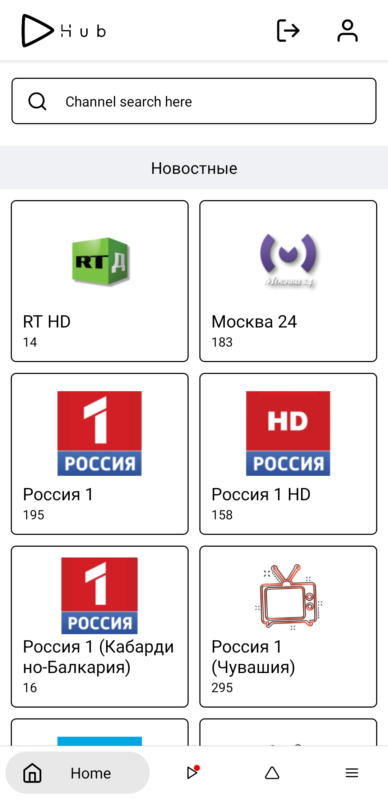 | 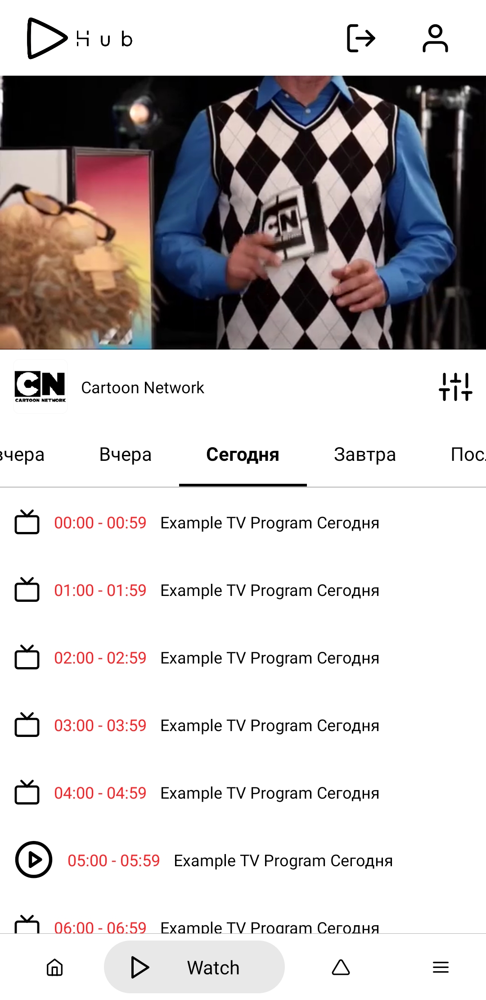
 | 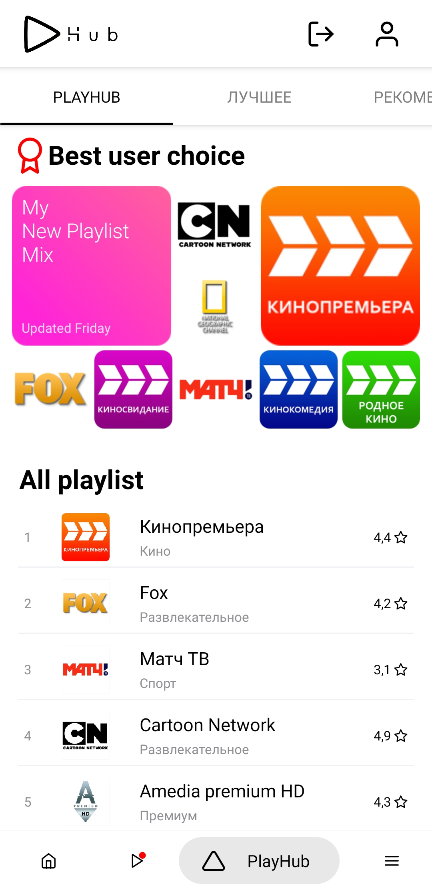 | 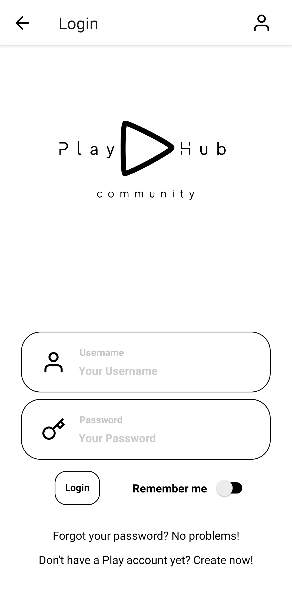
 |  |  
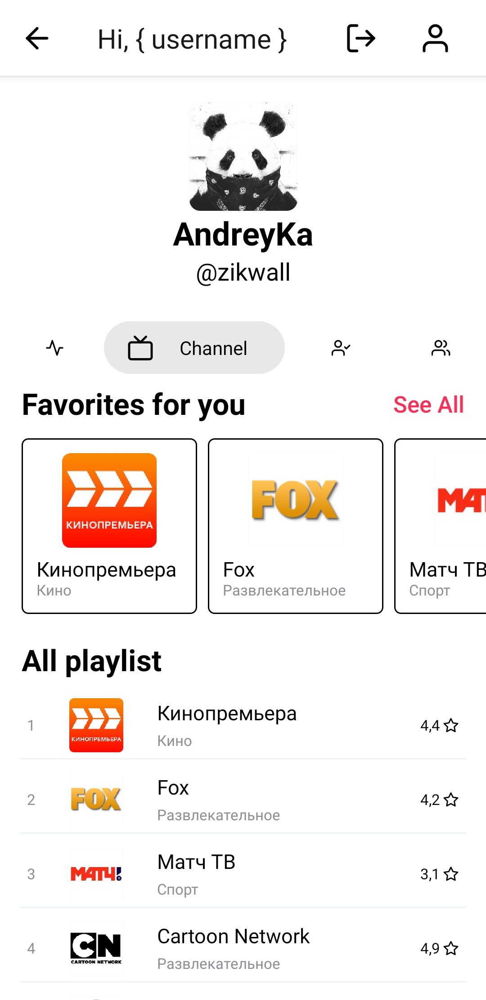 | 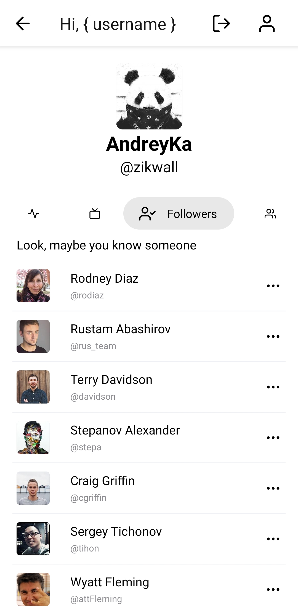 | 
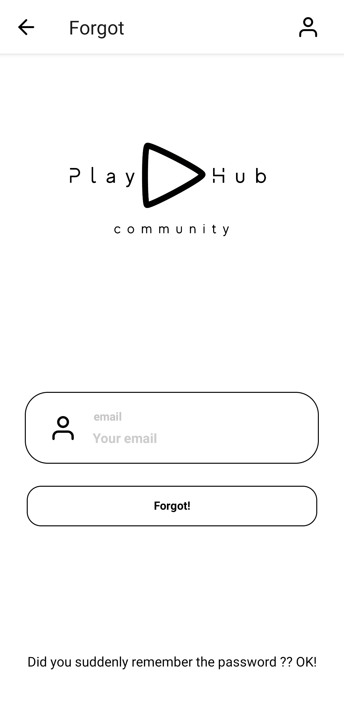 | 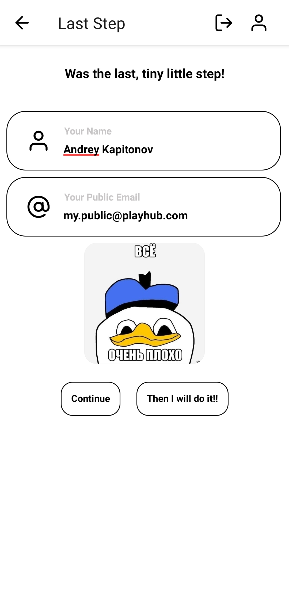 | 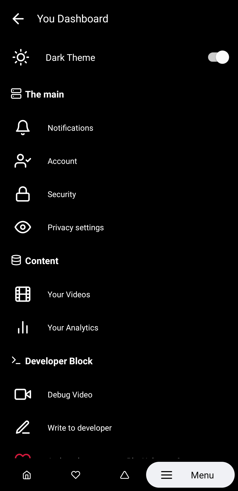
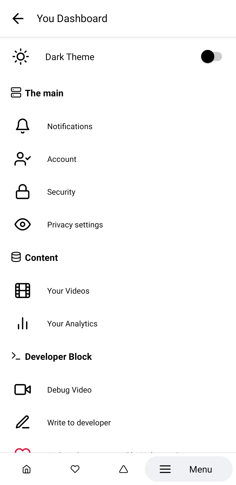 | 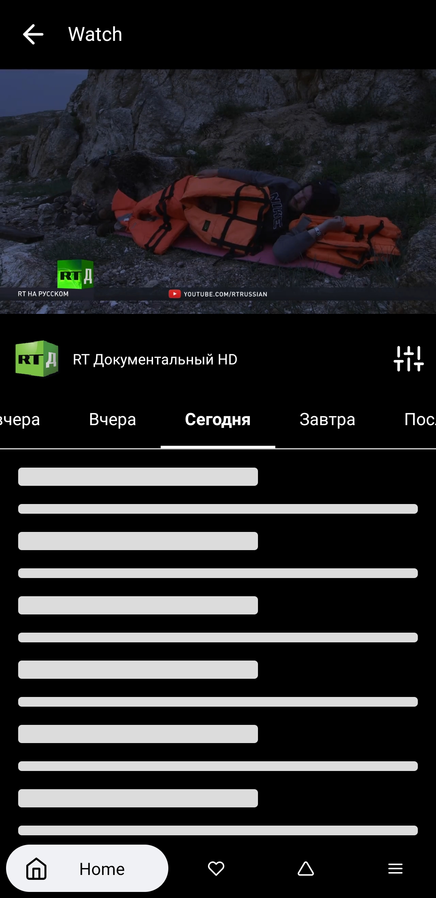 | 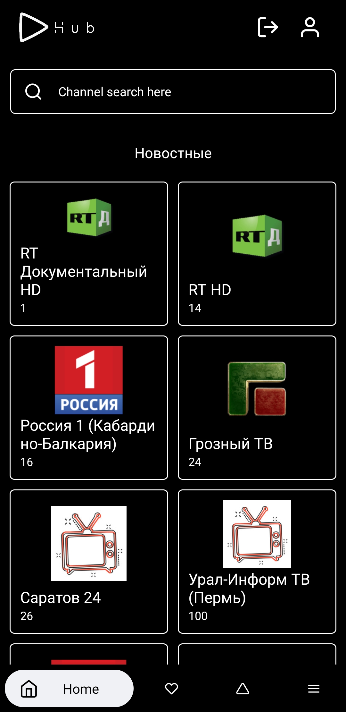
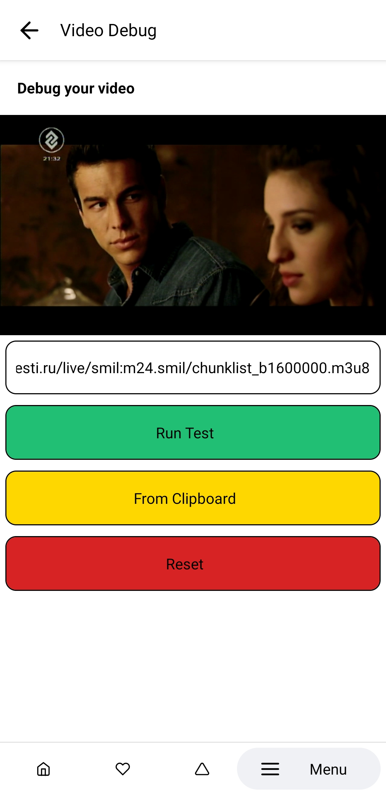 | coming | coming
### Responsive Layout

Mobile | Tabled/Pad
--- | --- |
 | 

### Disclaimer

At the moment, the code in some places may force you:

- scared
- I do not like
- refusal
- trembling skin

I apologize, everything will be fixed in the future. ^_^

> Premature optimization is the root of all evil (or at least most of it) in programming.
> -- <cite>[Donald Ervin Knuth][1]</cite> «Computer Programming as an Art», «Communications of the ACM» (Vol. 17, Issue 12)

[1]:http://www.paulgraham.com/knuth.html

Functionality, UI, screenshots and content in different languages: English and Russian. Soon there will be i18n.

### Related Projects

1. [VK TV Mini App (desktop)](https://github.com/zikwall/vk-tv-desctop)
2. [VK TV Mini App (mobile)](https://github.com/zikwall/vk-tv)
3. [SEO Friendly App by Next,js](https://github.com/zikwall/tv-next)
4. [Backend based on PHP7 via Yii2 (custom module)](https://github.com/zikwall/vk-tv-backend)
5. [Playlist parser (PHP)](https://github.com/zikwall/m3uparse)
6. [Playlist parser (Go)](https://github.com/zikwall/go3uparse)
